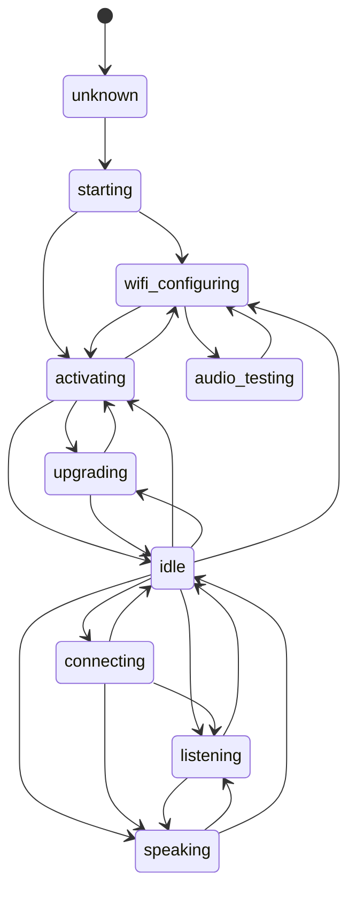
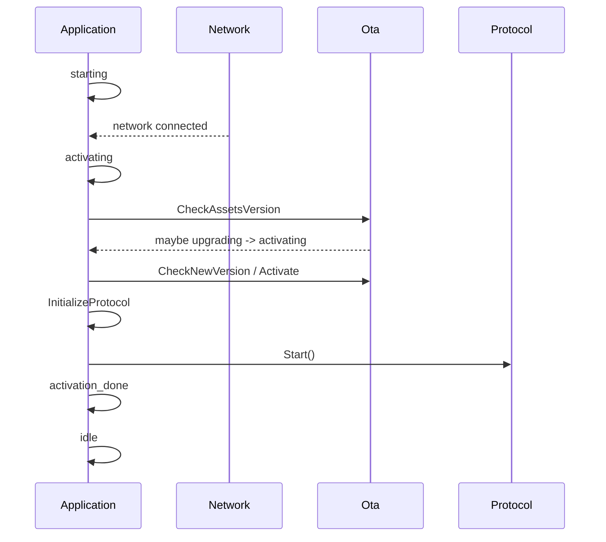
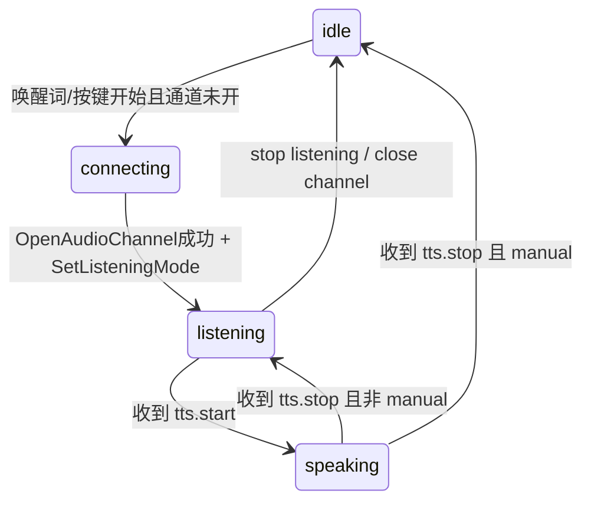
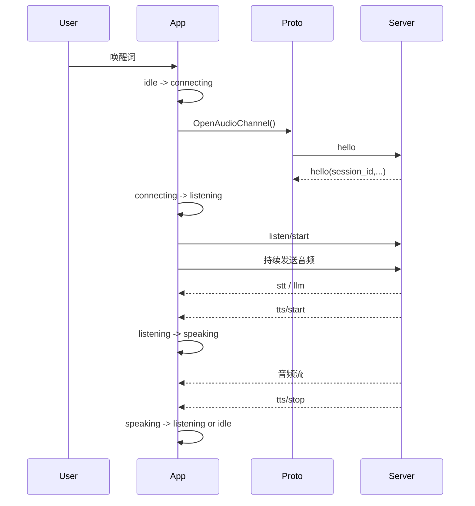
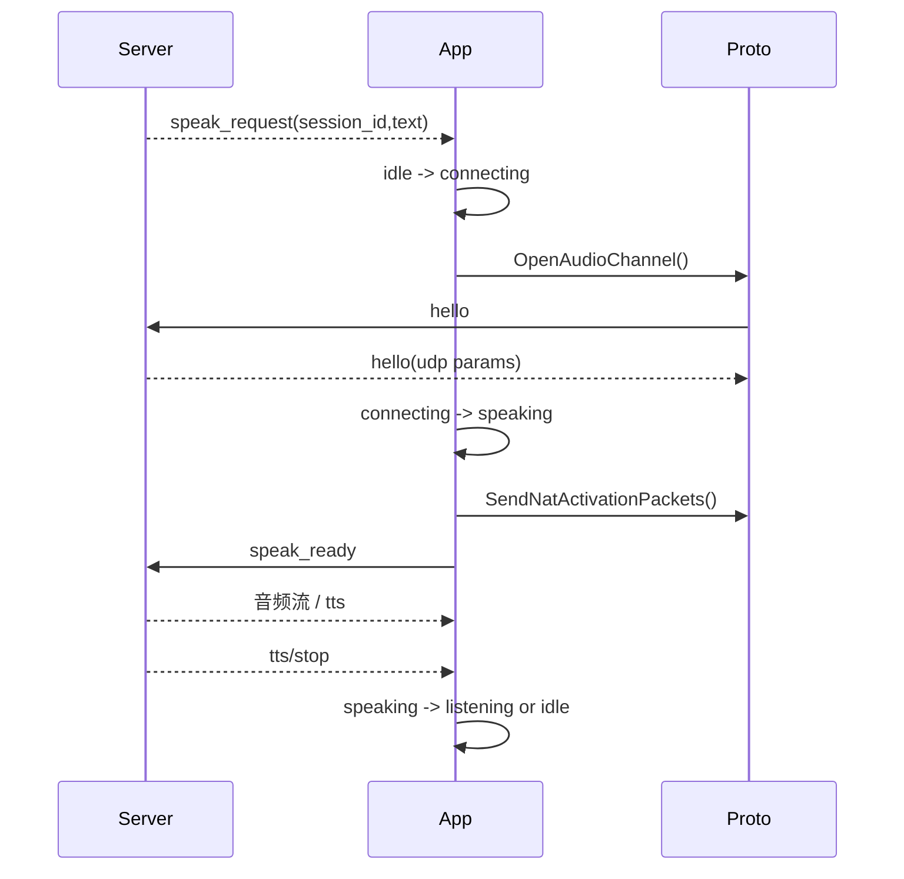

# 信令及状态流转总结

基于当前仓库代码梳理，重点参考：

- `main/device_state.h`
- `main/device_state_machine.cc`
- `main/application.cc`
- `main/protocols/protocol.cc`
- `main/protocols/websocket_protocol.cc`
- `main/protocols/mqtt_protocol.cc`

---

## 1. 总体分层

可以把当前实现拆成 3 层：

1. **状态层**：`DeviceStateMachine`
   - 负责状态枚举、合法迁移校验、状态变更通知。
2. **业务编排层**：`Application`
   - 负责主事件循环、网络事件、唤醒词、按键/触摸触发、协议回调、UI/音频联动。
3. **传输协议层**：`Protocol / WebsocketProtocol / MqttProtocol`
   - 负责 hello 握手、控制信令收发、音频流收发、断链/超时处理。

一句话概括：

> `Application` 决定“什么时候进入什么状态”，`Protocol` 决定“怎么跟服务端说话”，`DeviceStateMachine` 负责“这个状态切换是否合法”。

---

## 2. 状态枚举

定义见 `main/device_state.h`：

- `unknown`
- `starting`
- `wifi_configuring`
- `idle`
- `connecting`
- `listening`
- `speaking`
- `upgrading`
- `activating`
- `audio_testing`
- `fatal_error`

其中当前代码里最核心、最常用的是：

- `starting`
- `activating`
- `idle`
- `connecting`
- `listening`
- `speaking`

`fatal_error` 目前只在状态机里定义了约束，应用主流程里基本未实际进入。

---

## 3. 状态机允许的迁移

定义见 `main/device_state_machine.cc:22`。

### 3.1 全量迁移图



### 3.2 关键约束

- **不允许乱跳**，非法跳转会在日志里打印 warning。
- **同状态切换允许**，会被视为 no-op。
- `fatal_error` **不可恢复**，进入后不能再切出去。

---

## 4. Application 主事件驱动

`main/application.h` 里定义了主事件位，`Application::Run()` 是统一分发中心。

关键事件：

- `MAIN_EVENT_NETWORK_CONNECTED`
- `MAIN_EVENT_NETWORK_DISCONNECTED`
- `MAIN_EVENT_SEND_AUDIO`
- `MAIN_EVENT_WAKE_WORD_DETECTED`
- `MAIN_EVENT_START_LISTENING`
- `MAIN_EVENT_STOP_LISTENING`
- `MAIN_EVENT_STATE_CHANGED`
- `MAIN_EVENT_ERROR`
- `MAIN_EVENT_SCHEDULE`

它的运行方式是：

1. 外部模块触发事件位；
2. `Run()` 主循环取出事件；
3. 调用对应 handler；
4. handler 内可能触发状态切换；
5. 状态切换再触发 `MAIN_EVENT_STATE_CHANGED`；
6. `HandleStateChangedEvent()` 统一做 UI、音频、唤醒词、通道清理。

所以这里是一个典型的：

> **事件驱动 + 状态机约束 + 主线程串行编排**

---

## 5. 设备启动 / 激活流

主入口见：

- `Application::Initialize()`
- `Application::HandleNetworkConnectedEvent()`
- `Application::ActivationTask()`

### 5.1 启动主链路



### 5.2 细节

- 初始化时先进入 `starting`。
- 网络连上后，如果当前是 `starting` 或 `wifi_configuring`，切到 `activating`。
- 激活任务里会做：
  - 资源版本检查
  - 固件版本检查
  - 激活码/激活 challenge 处理
  - 初始化协议对象
- 激活完成后切到 `idle`。

### 5.3 `wifi_configuring` 说明

从当前 `Application` 代码看，**进入 `wifi_configuring` 的直接入口不在本文件里**，更像是由 board / network 配网层触发；应用层主要负责：

- `wifi_configuring -> activating`
- `wifi_configuring <-> audio_testing`

这点是根据当前仓库代码做的推断。

---

## 6. 会话相关核心状态流

### 6.1 用户主动发起：唤醒词 / 按键开始

入口：

- 唤醒词：`HandleWakeWordDetectedEvent()`
- 手动切换：`HandleToggleChatEvent()`
- 显式开始听：`HandleStartListeningEvent()`

典型路径：



### 6.2 空闲态 `idle`

`idle` 是待机态，同时也是**资源回收态**：

- 进入 `idle` 时：
  - 清空聊天显示
  - 关闭语音处理
  - 打开唤醒词检测
  - 如果音频通道还开着，会主动 `CloseAudioChannel()`

所以 `idle` 不是“保持会话”，而是“彻底收尾并待机”。

### 6.3 连接态 `connecting`

表示正在准备会话通道，常见动作：

- 建立 websocket / MQTT+UDP 音频通道
- 发送 client hello
- 等待 server hello

成功后通常转：

- `connecting -> listening`：普通用户发起会话
- `connecting -> speaking`：服务端下发 `speak_request` 后的被动唤起

失败则一般回到 `idle`。

### 6.4 监听态 `listening`

进入 `listening` 后，`HandleStateChangedEvent()` 会做：

- 更新 UI 为 listening
- 发送 `listen/start`
- 打开语音处理
- 根据编译配置决定是否保留监听中的唤醒词检测
- 必要时播放 popup 音

### 6.5 播放态 `speaking`

进入 `speaking` 后：

- 收到的服务端音频才会被推入解码播放队列
- 非 realtime 模式下会关闭语音处理
- 保留 AFE 唤醒词能力（如果支持）
- 重置解码器

---

## 7. 监听模式与状态回退

监听模式定义在 `main/protocols/protocol.h`：

- `kListeningModeAutoStop`
- `kListeningModeManualStop`
- `kListeningModeRealtime`

默认策略：

- **AEC 关闭**：默认 `auto`
- **AEC 开启**：默认 `realtime`

`tts.stop` 到来后的状态回退逻辑：

- `manual`：`speaking -> idle`
- `auto / realtime`：`speaking -> listening`

也就是说：

> `tts.stop` 并不一定结束整次会话，是否回到 `idle` 取决于 listening mode。

---

## 8. 客户端 -> 服务端信令

统一封装在 `main/protocols/protocol.cc`。

### 8.1 hello

建立音频会话时发送：

- WebSocket：`transport=websocket`
- MQTT：`transport=udp`

都带：

- `type=hello`
- `version`
- `features`
  - `aec`（按编译开关）
  - `mcp=true`
- `audio_params`
  - `format=opus`
  - `sample_rate=16000`
  - `channels=1`
  - `frame_duration`

### 8.2 listen/detect

唤醒词数据发送完后，可发送：

```json
{"session_id":"...","type":"listen","state":"detect","text":"唤醒词"}
```

用于告诉服务端“已经检测到唤醒词”。

### 8.3 listen/start

进入 `listening` 时发送：

```json
{"session_id":"...","type":"listen","state":"start","mode":"auto|manual|realtime"}
```

### 8.4 listen/stop

停止监听时发送：

```json
{"session_id":"...","type":"listen","state":"stop"}
```

### 8.5 abort

打断播报时发送：

```json
{"session_id":"...","type":"abort"}
```

如果是“播报中再次命中唤醒词”，还会带：

```json
{"session_id":"...","type":"abort","reason":"wake_word_detected"}
```

### 8.6 mcp

设备向服务端发 MCP 数据：

```json
{"session_id":"...","type":"mcp","payload":{...}}
```

### 8.7 speak_ready

服务端 `speak_request` 场景下，设备在音频通道准备完成后发送：

```json
{"session_id":"...","type":"speak_ready","state":"ready"}
```

### 8.8 goodbye

仅 MQTT 分支在客户端主动关音频通道时发送：

```json
{"session_id":"...","type":"goodbye"}
```

WebSocket 分支关闭时不额外发 goodbye，直接断开连接。

---

## 9. 服务端 -> 客户端信令

主要在 `Application::InitializeProtocol()` 注册的 `OnIncomingJson()` 里处理。

### 9.1 `hello`

用于响应客户端 hello。

客户端会从中拿到：

- `session_id`
- 服务端音频参数
- 传输信息
  - WebSocket：确认 `transport=websocket`
  - MQTT：拿到 UDP `server/port/key/nonce`

### 9.2 `tts`

当前处理了 3 个状态：

- `tts/start`
  - `aborted_ = false`
  - 切到 `speaking`
- `tts/stop`
  - `manual` 模式回 `idle`
  - 其他模式回 `listening`
- `tts/sentence_start`
  - 更新 assistant 文本

这是**会话状态切换最核心的一组下行信令**。

### 9.3 `stt`

- 提取 `text`
- 更新用户文本显示

不直接改状态。

### 9.4 `llm`

- 提取 `emotion`
- 更新表情/情绪 UI

不直接改状态。

### 9.5 `mcp`

- 将 `payload` 交给 `McpServer::ParseMessage()`

### 9.6 `system`

当前只处理：

- `command = reboot`

### 9.7 `alert`

- 展示 `status / message / emotion`
- 播放振动提示音

### 9.8 `speak_request`

这是服务端主动拉起设备播报的入口，典型用于 MQTT 常驻控制通道。

处理逻辑：

1. 当前必须是 `idle`
2. 切到 `connecting`
3. 异步打开音频通道
4. 切到 `speaking`
5. 发送 NAT 激活包（MQTT/UDP）
6. 回发 `speak_ready`

### 9.9 `goodbye`

MQTT 控制面收到服务端 `goodbye` 后：

- 如果 `session_id` 匹配
- 客户端会 `CloseAudioChannel(false)`

这里显式禁止“收到 goodbye 后再回 goodbye”，避免 ping-pong。

---

## 10. 音频流承载方式

### 10.1 WebSocket

`WebsocketProtocol::OpenAudioChannel()`：

- 建立 websocket
- 设置 header：
  - `Authorization`
  - `Protocol-Version`
  - `Device-Id`
  - `Client-Id`
- 连接成功后发 hello
- 等待 server hello

音频上行/下行：

- version 1：直接二进制 opus
- version 2：`BinaryProtocol2`
- version 3：`BinaryProtocol3`

### 10.2 MQTT

MQTT 分两层：

1. **MQTT 控制面**
   - 发/收 JSON 信令
2. **UDP 音频面**
   - 发/收加密 OPUS 数据

`MqttProtocol::OpenAudioChannel()` 流程：

1. 若 MQTT 未连上，先连 MQTT
2. 发 hello，请求 UDP 音频通道
3. 等待 server hello
4. 从 hello 里拿到：
   - `udp.server`
   - `udp.port`
   - `udp.key`
   - `udp.nonce`
5. 建立 UDP
6. 用 AES-CTR 收发音频

### 10.3 MQTT NAT 激活

服务端主动 `speak_request` 时，设备在自己还没发送正式音频前，服务端不一定能穿透回包。

所以会额外发送 3 个空 UDP 包：

- `SendNatActivationPackets()`

作用就是：

> 先把 NAT 映射打通，让服务端音频能反向打回来。

---

## 11. 3 条最常见时序

### 11.1 唤醒词对话



### 11.2 手动按键开始 / 停止

```text
idle
  -> HandleStartListeningEvent / HandleToggleChatEvent
  -> connecting（若通道未开）
  -> listening
  -> HandleStopListeningEvent
  -> send listen/stop
  -> idle
```

### 11.3 服务端主动播报（MQTT）



---

## 12. 状态与信令的对应关系

| 触发 | 主要信令/事件 | 典型状态变化 |
|---|---|---|
| 开机 | 本地初始化 | `unknown -> starting` |
| 网络连通 | `MAIN_EVENT_NETWORK_CONNECTED` | `starting/wifi_configuring -> activating` |
| 激活完成 | `MAIN_EVENT_ACTIVATION_DONE` | `activating -> idle` |
| 唤醒词命中 | 本地事件 | `idle -> connecting -> listening` |
| 手动开始 | 本地事件 | `idle -> connecting -> listening` 或 `idle -> listening` |
| 服务端开始播报 | `tts/start` | `listening/connecting -> speaking` |
| 服务端播报结束 | `tts/stop` | `speaking -> listening/idle` |
| 用户主动停止监听 | `listen/stop` | `listening -> idle` |
| 播报中再次唤醒 | `abort(reason=wake_word_detected)` | `speaking -> listening` |
| 网络断开 | `MAIN_EVENT_NETWORK_DISCONNECTED` | `connecting/listening/speaking -> idle`（通过 close channel 收尾） |
| 服务端主动播报请求 | `speak_request` | `idle -> connecting -> speaking` |

---

## 13. 几个容易忽略的实现点

### 13.1 `idle` 会主动关通道

进入 `idle` 时，如果协议通道仍开着，应用会主动关闭。

这意味着：

- 旧 session 不会被复用太久
- 能规避 NAT 超时 / 脏会话问题
- 也解释了为什么 websocket 空闲时通常不会保持长连音频通道

### 13.2 `speak_request` 更适合 MQTT

代码里已经明确注释：

- WebSocket 空闲时音频通道通常断开
- 服务端无法在 idle 时主动推 `speak_request`
- MQTT 因为控制面常驻，更适合服务端主动唤起

### 13.3 `tts` 是会话状态推进的关键下行信令

虽然 STT/LLM/MCP 都在走 JSON，但真正驱动“听/说”切换的是：

- `tts/start`
- `tts/stop`

### 13.4 `fatal_error` 目前偏保留位

状态机支持它，但应用层当前没有明显主路径进入它。

---

## 14. 建议把它记成一句话

### 14.1 信令主线

> `hello -> listen(start/detect/stop) -> tts/stt/llm/mcp -> abort/goodbye/speak_ready`

### 14.2 状态主线

> `starting -> activating -> idle -> connecting -> listening <-> speaking -> idle`

---

## 15. 参考代码位置

- 状态定义：`main/device_state.h:4`
- 状态迁移规则：`main/device_state_machine.cc:22`
- 网络连通/断开：`main/application.cc:254`、`main/application.cc:281`
- 协议初始化与消息分发：`main/application.cc:475`、`main/application.cc:523`
- 手动切换/开始/停止监听：`main/application.cc:684`、`736`、`767`
- 唤醒词处理：`main/application.cc:782`、`827`
- 状态变化副作用：`main/application.cc:857`
- 服务端主动播报：`main/application.cc:1116`、`1144`
- 通用控制信令：`main/protocols/protocol.cc:39`、`48`、`55`、`69`、`75`、`81`
- WebSocket 握手：`main/protocols/websocket_protocol.cc:83`、`228`
- MQTT/UDP 握手：`main/protocols/mqtt_protocol.cc:217`、`303`、`352`
